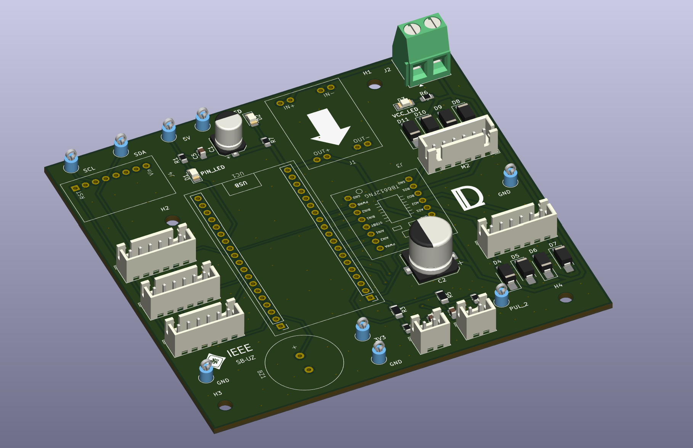
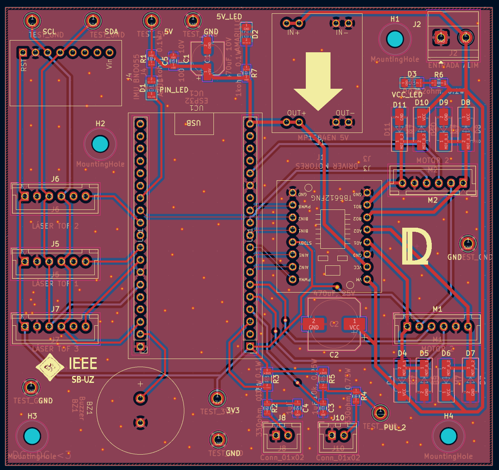
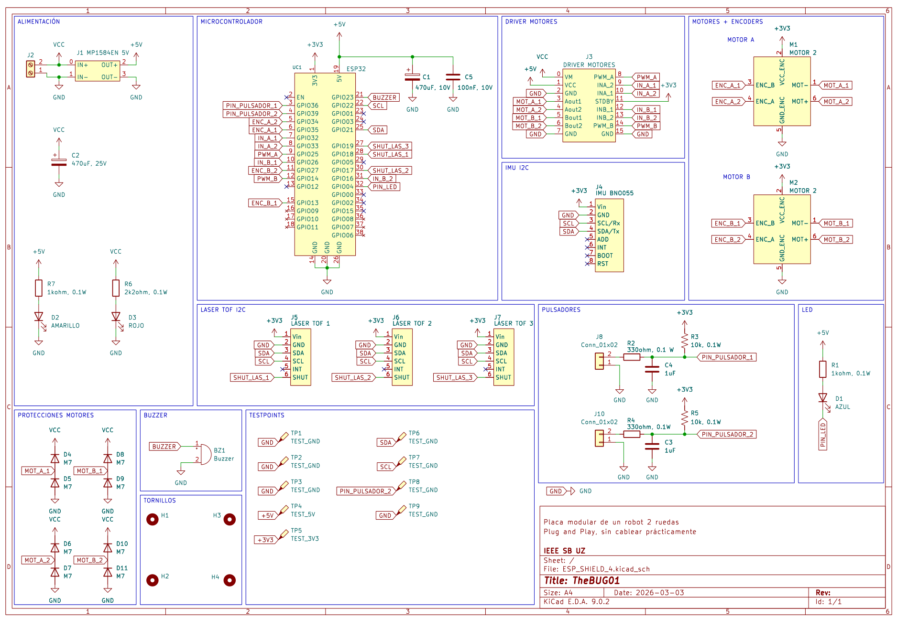

## 🇬🇧 Project Description (English)

This project is a custom **all-in-one PCB** for a **two-wheel differential drive robot**, designed to be **plug-and-play** and easy to integrate into new robotics prototypes. The board brings together the key building blocks needed for motion control and autonomous navigation, so you can focus on software and algorithms instead of wiring and power integration.

### Key Features

* **2-wheel robot control PCB** with integrated peripherals for rapid development.
* **IMU (Inertial Measurement Unit)** for orientation and motion sensing.
* **3× TOF400 laser distance sensors** connected via **I²C**, enabling obstacle detection and basic autonomous navigation.
* **TB6612FNG dual motor driver** for controlling the DC motors efficiently (PWM + direction control).
* **Motor protection circuitry** to handle cases where motors behave like generators (back-EMF / regenerative effects), improving robustness and protecting the power stage.
* **Push buttons** with **RC filtering** and **external pull-up**, providing stable, noise-resistant digital inputs.
* **Test LEDs** for quick debugging and status indication during bring-up.
* **Integrated DC-DC converter** to step down from the **battery voltage** to the robot’s required internal rail(s), simplifying power distribution and improving overall reliability.

### PCB Layout

### Schematic

### Goal

The goal of this PCB is to provide a compact robotics platform with **everything integrated**: power regulation, sensing, motor driving, and basic user I/O. With this hardware, you can quickly implement and iterate on:

* Wheel speed and position control loops
* Differential drive kinematics
* Sensor-based navigation using the TOF lasers
* Autonomous behaviors (obstacle avoidance, wall following, basic SLAM-ready sensing layout)

---

## 🇪🇸 Descripción del proyecto (Español)

Este proyecto es una **PCB todo-en-uno** para un **robot diferencial de dos ruedas**, pensada para ser **plug-and-play** y facilitar el desarrollo rápido de prototipos. La placa integra los bloques principales necesarios para control de movimiento y navegación autónoma, evitando cableado extra y problemas de integración de potencia.

### Características principales

* **PCB de control para robot de 2 ruedas** con periféricos integrados para desarrollo rápido.
* **IMU (Unidad de Medición Inercial)** para estimar orientación y movimiento.
* **3× sensores láser de distancia TOF400** por **I²C**, para detección de obstáculos y navegación básica.
* **Driver dual TB6612FNG** para el control eficiente de motores DC (PWM + dirección).
* **Circuitería de protección para motores** cuando actúan como generadores (back-EMF / regeneración), aumentando la robustez y protegiendo la etapa de potencia.
* **Pulsadores** con **filtro RC** y **pull-up externa**, para entradas digitales estables y resistentes al ruido.
* **LEDs de testeo** para depuración rápida y verificación del estado durante el bring-up.
* **Convertidor DC-DC integrado** para bajar la **tensión de baterías** a las líneas internas del robot, simplificando la distribución de potencia.

### Objetivo

El objetivo es ofrecer una plataforma compacta con **todo integrado**: regulación de potencia, sensórica, driver de motores y E/S básica. Con este hardware se pueden implementar de forma rápida:

* Control de velocidad/posición de ruedas
* Cinemática diferencial
* Navegación basada en sensores TOF
* Comportamientos autónomos (evitación de obstáculos, seguimiento de pared, base para SLAM)

---

**Status:** In development / prototyping.
**Use case:** Educational robotics, research prototypes, fast integration platform
**In collaboration with Carlos Rios Ferrer**
